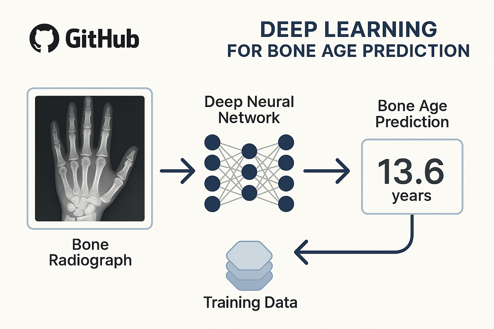

# 🦴 Bone Age Estimation System

 

This application estimates bone age (in months) from hand X-ray images using an ensemble of deep learning models. Designed for medical professionals and researchers, it provides quick predictions to assist in pediatric development assessment.

## 🚀 Features
- Ensemble learning with 5 EfficientNetV2 models
- GPU acceleration support (NVIDIA CUDA required)
- Intuitive web interface using Gradio
- Handles images of any aspect ratio
- Prediction range: 0-240 months (20 years)
- Automatic hardware detection (falls back to CPU if GPU unavailable)

## ⚙️ System Requirements
1. **Hardware**:
   - NVIDIA GPU with CUDA support (recommended)
   - Minimum 4GB VRAM
2. **Software**:
   - Windows/Linux/macOS
   - Python 3.8+
   - CUDA 11.x (for GPU acceleration)

## 💻 Installation
```bash
# Clone repository
git clone https://github.com/mhdi002/bone-age-estimation.git
cd bone-age-estimation

# Install dependencies
pip install torch timm gradio pillow numpy

## 🐳 Docker Support
This application can also be run using Docker. A `Dockerfile` is provided to build an image with all necessary dependencies.

### Build the Docker Image
```bash
docker build -t bone-age-estimation .
```

### Run the Docker Container
```bash
# Make sure you have NVIDIA Docker support if using GPU
# For GPU support:
docker run --gpus all -p 7860:7860 bone-age-estimation

# For CPU only (if you built an image without GPU requirements or want to run on CPU):
# Note: The current Dockerfile is configured for CUDA.
# You might need to adjust it for CPU-only execution if GPU is not available on the host.
docker run -p 7860:7860 bone-age-estimation
```
Access the application by navigating to `http://localhost:7860` in your web browser.

## ⚙️ CI/CD Pipeline
This repository uses GitHub Actions for CI/CD. On every push to the `main` branch, the following actions are performed:
1. The Docker image is built.
2. The Docker image is pushed to Docker Hub (repository: `your-dockerhub-username/bone-age-estimation` - *please update this in `.github/workflows/ci.yml` and here if you fork the repo*).

You will need to configure `DOCKERHUB_USERNAME` and `DOCKERHUB_TOKEN` secrets in your GitHub repository settings for the pipeline to push the image successfully.
